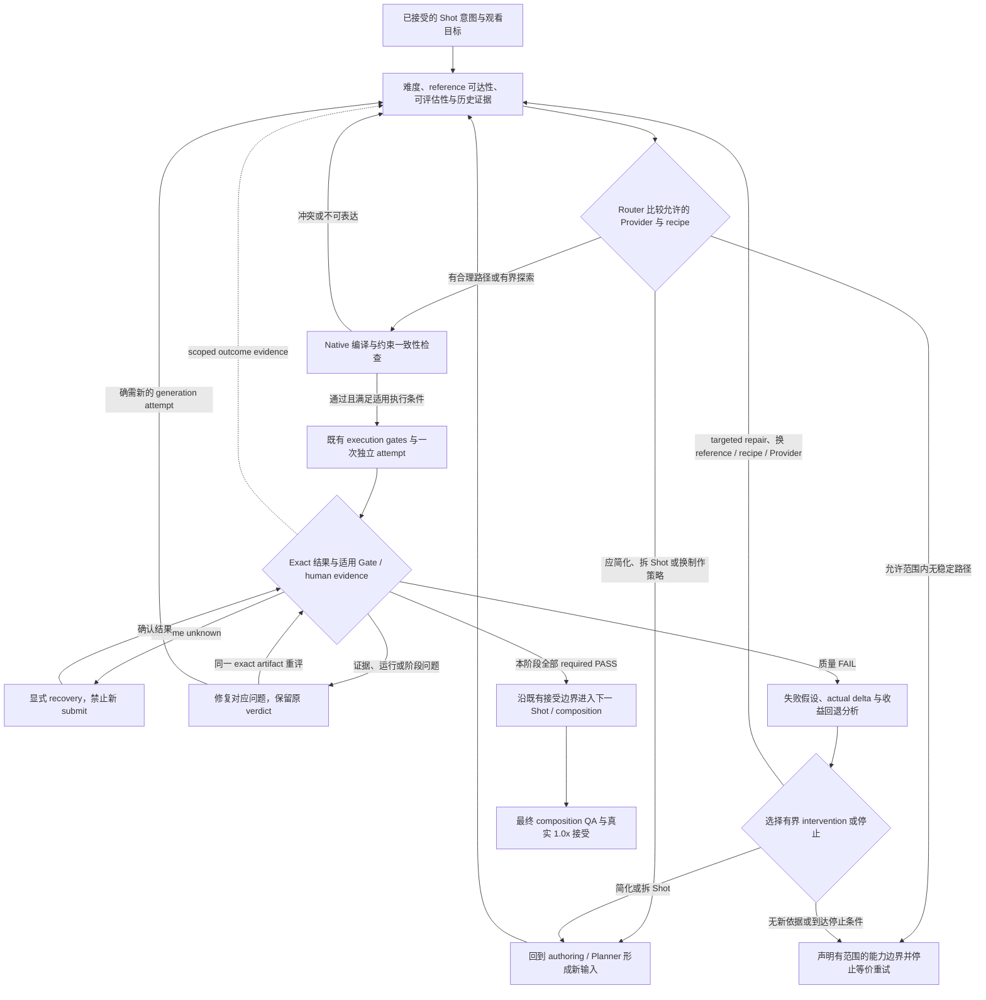

# AI-VIDEO Generation Decision Loop Specification

## Status And Authority

Date: 2026-09-06。

本 Spec 根据当前源码、历史 records 与真实 Shot attempts 的只读审计提出目标契约，状态为
`proposed`。目标是让系统在首次生成和每次失败后，根据 Shot 难度、模型适配和失败证据选择下一步。
它不表示实现已开始、质量已验证或现有 Production contract 已改变。

本轮授权只覆盖编写 Spec；不包含 implementation plan、代码修改、Provider 调用、媒体生成、
Production mutation、policy adoption、commit 或 push。本文中的 future behavior 只有在后续对应
contract change 被接受并完成实现验证后，才能成为 runtime behavior。

本 Spec 延续 [Empirical Quality Evolution](2026-08-27-ai-video-empirical-quality-evolution-and-commercial-qa.md)
的经验优先和 human evidence 边界，补足其未实现的 generation decision contract；不取代
[Quality Gate Architecture](2026-08-25-ai-video-quality-gate-architecture-separation.md)、
[Drama Authoring And Acceptance](2026-08-28-ai-video-drama-authoring-and-acceptance.md) 或既有 P6 lifecycle。
不把旧 proposed spec 的阶段性资源分配或非目标，误写成当前已实施的限制。

## Problem And Evidence

核心问题是：**同一个 Shot 的失败被充分记录，但这些失败尚未稳定地改变下一次生成决策。**
新的 attempt identity、合法 request、完整 Gate finding 和 repair receipt，本身不保证下一次更有希望成功。

以下为 2026-09-06 审计截点的证据，不是各 Provider 的全局 benchmark。样本属于不同模型、配方、画幅、
rubric 和用户约束，不能合并计算一个 Provider 排行榜。

| Evidence | Verified observation | Supported conclusion and limit |
| --- | --- | --- |
| E1：[H3 S01 bounded repairs](../../record_for_agent/2026-09-06-jieshi-s01-local-h3-bounded-repairs.md)，`runs/jieshi-s01-h3-horizontal-20260906-001` 至 `-031` | 001–012、015–029 共 27 个 raw MP4，无 required findings 全 PASS；013、014、030 为无 MP4 的 OOM，031 仅准备。完整广播版本常超时，进入窗口的版本又丢姓名或错词；020–029 持续出现手部倒影 | 存在重复失败和跨维度取舍。不能把 OOM 或缺少主观音频证据计为模型质量 FAIL；也不能据此断言 H3 在所有配方下无法完成 |
| E2：[Vidu S01 最新纠正](../../record_for_agent/2026-09-06-generated-video-audio-derivation.md)，`runs/jieshi-e01-i2v-20260906-attempt01` 至 `attempt09` | 手、相机、字幕与广播 timing 的局部改善没有汇合成可接受结果；用户否定 07 editorial preview 的手部运动，密集抽帧发现早期稀疏检查遗漏的问题 | 不能沿用“07 画面可用”作为保留成功部分的前提。旧末帧存在手型风险，但尚无视频 A/B 证明其因果作用 |
| E3：[H3 conditioning attribution](../../record_for_agent/2026-08-27-h3-conditioning-attribution-gate-stop.md) | A/B 在同一 seed、first frame、prompt 和 Stock20 配方下更换 last frame；A 尾部突变/冻结，B technical PASS。C first-only、D 另一配方也 technical PASS | 支持这个 exact 实验中的 endpoint conditioning 效应。B/C/D 不因此获得 human acceptance，也不证明所有 first/last-frame 策略有害 |
| E4：[Seedance Mini 首次整广告](../../record_for_agent/2026-08-28-qingyan-seedance-mini-complete-ad-gate-stop.md)，两次 exact Gate：[001](../../../runs/qingyan-seedance-mini-complete-ad-20260828-001/evidence/post-media-gate.md)、[002](../../../runs/qingyan-seedance-mini-complete-ad-20260828-002/evidence/post-media-gate.md) | 两次 15 秒云端生成；第二次同时改变 native audio、prompt 和 profile。style 改善，但交接/对白先后、喷洒位置及情绪因果仍失败或未评估 | 云端同样存在修一项、损另一项的问题；这不是 audio-only 对照，也不能推广到所有 Seedance 版本 |
| E5：[H3 M6 causal micro-sequence](../../record_for_agent/2026-08-28-h3-m6-causal-micro-sequence-gate-stop.md) | narrow technical findings 通过后，用户仍以整片观感拒绝 | Gate 既可能错误阻断，也可能漏掉观众实际不能接受的问题；解决方向不是普遍降低 threshold |
| E6：[MiniMax H3/Hailuo portability smoke](../../record_for_agent/2026-08-20-h3-hailuo-portability-smoke.md) | Hailuo 有真实 fetch 证据，但缺少与以上案例同等的连续质量 repair cohort；cloud H3 的额度/余额失败属于执行失败 | 当前不足以证明 MiniMax 云端具有相同的具体模型缺陷；只能审计它们共用的上游决策机制 |

源码解释了这些现象为什么可能持续：

- [VideoPlanner](../../../src/ai_video/planning/video_planner.py) 的 motion 分类和固定 `confidence`
  不等于 Shot 完成概率；[ShotReadinessGate](../../../src/ai_video/quality_gates/shot_readiness_gate.py)
  验证 binding、eligibility 和 assets，不判断一般性的 Shot × Provider × recipe 难度。
  [M0 feasibility](../../../src/ai_video/production/shot_continuity_m0_feasibility.py) 已有狭窄的人工 endpoint
  检查，因此缺口是通用决策能力，不是“仓库完全没有 feasibility”。
- [VideoGenerationResolver.resolve_requirement](../../../src/ai_video/production/shot_router.py) 接收已经选好的
  profile、capabilities 和 `selected_capability_id`，当前实际完成 exact compatibility binding。
  [CapabilityNeed](../../../src/ai_video/production/video_requirement.py) 与
  [VideoCapabilityVariant](../../../src/ai_video/production/video.py) 主要表达可请求的接口能力。
- [video_compiler](../../../src/ai_video/production/video_compiler.py) 的通用编译路径机械序列化中立字段；
  Local H3 的 [_h3_prompt](../../../src/ai_video/production/_h3_prompt.py) 与 Vidu 的
  [_vidu_prompt](../../../src/ai_video/production/_vidu_prompt.py) 已有 native expression。
  所以需要否定的是“统一字段展开足以构成有效配方”，而不是否定所有 neutral intent 或 native compiler。
  prompt 过长导致失败仍是待验证假设。
- 通用 compiler 当前设置 `seed=None`；[T8 native](../../../src/ai_video/production/comfy_t8_native_turbo_video.py)
  的 `_effective_seed` 由 request hash 派生。新的
  [bound lifecycle identity](../../../src/ai_video/production/_shot_router_contracts.py) 可间接改变该 hash。
  因此“只改 prompt”不等于实际只改一个生成变量；这影响归因，不直接证明随机 seed 降低成功率。
- [RepairRequest / RepairAction](../../../src/ai_video/production/models.py) 与
  [repair committer](../../../src/ai_video/production/_state_commit_repair.py) 能绑定假设、动作和结果，
  但不负责判断哪个变量最可能是原因。[Q0 dataset](../../../src/ai_video/quality_intelligence/dataset.py)
  提供记录和 lookup，尚不等于 planner/router/repair 的经验决策器。

已有 [H3 visible-context learning](../../record_for_agent/learning/h3-shot-local-visible-context.md) 真正进入
[h3-video guidance](../../../.agents/skills/h3-video/SKILL.md)，说明 learning 并非完全没有反馈。
本 Spec 要补的是持续、可归因、可复核的任务内决策，以及有边界的跨任务复用。

## Goals And Non-Goals

### Goals

1. submit 前区分“request 合法”与“这个 Shot 对这套配方是否有合理完成路径”。
2. 比较完整的 generation recipe，体现不同 Provider/model 的经验优势、弱点和未知区域。
3. 每次真实失败后，给出基于证据的 repair、重新创作、策略升级或停止建议，避免默认再生成一个 variant。
4. 在修复目标缺陷时显式保护其他已达标维度，并重新验证新 bytes，减少整镜反复损失已有收益。
5. 让 Gate 的阶段、证据能力和阈值服务于已接受的 production 目标，同时保留真实观感缺陷的阻断能力。
6. 让历史 evidence 改变后续决策，并明确哪些只是任务内假设，哪些已成为正式 adopted policy。

### Non-Goals

- 不承诺每一次 retry 的真实成功概率都单调增加，也不在缺少统计依据时输出百分比。
- 不建立第三个 top-level quality Gate、第二个 Manifest、第二个 timeline、独立 activation 或 recovery owner。
- 不设计通用 Agent runtime、训练平台、Provider marketplace、队列、Console 或全模型 benchmark 系统。
- 不默认把复杂 Shot 全部拆开、把 native audio 全部替换、放弃 continuity，或一律改用云端。
- 不将特定模型的一次成功、Skill 建议或营销能力声明直接变成 production qualification。
- 不在本 Spec 中指定实现步骤、具体 class/schema migration 或新的公共 CLI/API。

## Target Behavior And Single Ownership

**Generation Decision Policy 是既有 Shot Router 职责的扩展，不是 Router 前面的第二个 selector。**
它在 request seal 前选择或建议 generation route/recipe，并在收到失败诊断后选择下一项 intervention。
它是消费显式输入的纯决策边界，不读取 secret、不调用 Provider、不执行生成，也不拥有 mutable lifecycle。

当前 [Router spec](2026-08-19-ai-video-shot-router.md) 的 degraded contract 允许外部预选 exact Provider，
而较新的 [neutral requirement spec](2026-08-21-ai-video-provider-neutral-generation-requirement.md) 和
[contract matrix](../../agent-primary-contract-matrix.md) 将 exact selection identity 归于 Router，
同时仍明确排除 Provider ranking。这些文档没有证明经验质量排名已被接受或实现。
本 Spec 提出扩展并收敛该契约：**新 generation decision path 的 selection/ranking 只归 Router；外部
caller 只提供候选目录、输入证据、用户指定的限制和适用执行范围。** 后续实施必须同步上述 Router、
neutral requirement 与 matrix 的相应条款；不能只新增一个 selector 就声称契约已收敛。
在该变更正式实施前，现有 contract 仍有效；request seal 后禁止 fallback 的语义始终保留。

| Concern | Target responsibility |
| --- | --- |
| Creative intent and acceptance target | 继续由已接受的 Character / Scene / Shot artifacts 与相应 domain authoring owner 决定；Router 不能重写剧情、台词、continuity 或交付标准 |
| Requirement derivation | `VideoPlanner` 继续独占从当前 canonical 输入派生中立 requirement；同时暴露难度相关事实、冲突和未决输入，而不是伪造成功概率 |
| Feasibility, recipe comparison and next intervention | Shot Router 内的 Generation Decision Policy 比较 Shot × model/profile × recipe；只输出 proposal 或选定结果，不执行 repair |
| Native expression | 选定 adapter 的 compiler 确定性表达已选择的 recipe；不得私下简化、删掉 requirements、改选模型或补造 reference |
| Evidence and adjudication | 既有 analyzer、Universal QA、selected Domain Gate、P6 与真实 human evidence 各自保持 authority；diagnosis 消费 findings，不改写 verdict |
| Execution and persistence | 既有 orchestration 执行满足适用执行条件的决策；`ProductionStateCommitter` 继续独占 durable mutation、activation、review/repair 和 explicit recovery |
| Empirical knowledge | Q0 / curated records 保持 advisory；由外层读取并注入受限 evidence projection，Production package 不直接读取 Q0 store 或把它当 writer |

外层 evidence/authoring flow 提供可追溯的观察与原因假设 proposal；Generation Decision Policy 负责比较
这些假设与反证，选择下一项 intervention。外层不能提交一个预选 repair 再要求 Router 形式确认。
既有 repair authorizer 仍决定该动作是否被允许，committer 仍独占持久化；诊断不是新的 repair writer。
这个 logical owner 不要求把 authoring、evaluator 或执行逻辑集中塞入 `shot_router.py`。

Router 可以建议另一 generation mode，但不得改写 Planner 已 seal 的 requirement。涉及 mode、reference
roles 或 intent 变化时，必须回到对应 authoring/Planner owner，形成新的 current projection，再进入 Router。
只改变 Provider/profile 且中立意图未变时，也必须重新验证 exact compatibility、sequence route binding
和 seal。[apply_continuity_transition](../../../src/ai_video/production/_video_requirement_routing.py) 的
same-stack Provider lock、cross-stack destination route 与 conditioning 要求不能被普通 capability PASS
覆盖；换 route 必须由既有 continuity owner 形成有效的新 transition，而不是 adapter fallback。

新路径不得继续让 caller 先决定 `selected_capability_id`，再把 compatibility PASS 宣称为经验选型。
底层 exact binder、registry exact lookup 及 historical replay 可保留各自职责；它们不得成为另一条新任务
selection/fallback 通路。用户明确固定 Provider/model 属于输入约束，不属于 caller 的隐式排名。

## Decision Input Contract

决策必须绑定当前 Shot revision、requirement、适用 rubric、reference bytes、候选 capability/profile/compiler
identity、decision policy 的 ID/version/content hash，以及候选与历史 evidence snapshots 的确切范围。
缺失信息保持 unknown，不由长 prompt 或固定 confidence 掩盖。

相同 current inputs、policy、候选和 evidence snapshots 必须得到相同 decision 和可重放解释，不能因
Provider 注册顺序或 dict order 改变选择。tie、证据不足和缺少决策依据必须显式表达；不得任取首项。
若 Agent/model 提供语义观察或原因假设，其结果是需验证并绑定出处的输入 proposal，纯 Router 不调用
该模型，也不把 RAG 自由文本当执行指令。

policy/evidence 变化须重新评估并形成对应 decision identity，但不能仅因解释文字或 advisory evidence
变化就重生成媒体。只有实际生成语义或适用契约的变化交由既有 freshness/Dependency Graph owner 决定
影响范围；audit identity 与 semantic routing identity 继续分离。无新输入、证据或约束时，Planner、Router
与 compiler 不得自动往返同一冲突，应返回 unresolved conflict 或明确停止原因。

### Intent And Difficulty

难度必须描述组合关系，不能只统计字数、动作数量、人物总数或时长。

| Dimension | Required distinction |
| --- | --- |
| Actions and time | 动作数量、先后/同时关系、起止状态、停顿、总时间窗及需要保持的姿态；区分叙事 deadline 与为了生成留余量的提示 |
| Characters and performance | 主动表演人数、静态背景人数、轮流/重叠对白、角色区分、视线和情绪转换；不能把七个静态倒影等同于七人互动 |
| Object interaction | 左右手、握持、接触/不接触、交接、遮挡、物体状态变化及使用机制 |
| Camera and space | 主体运动与相机运动的组合、景别/轴线、空间变化、出入画、需要连续成立的关系 |
| Continuity and identity | 哪些身份、服装、道具、场景状态必须延续；哪些是 exact pixel endpoint，哪些只需 semantic/reference continuity |
| Dialogue and sound | exact text、发音、表演、时间窗、口型、画内/画外音、native source policy，以及后期允许处理的范围 |
| Exceptional behavior | 镜像缺失、非现实物理、复杂反射、精细文字等对模型常见先验的反向要求 |
| Output and viewing | 目标画幅、分辨率、可用时长、观看速度、domain 目标和主观最低观感要求 |

例如 S01 的风险不是简单的“抬一次手”：它叠加左右手/手机、近玻璃停稳、只删除主角及手的反射、
保留其他反射、locked camera、准确的画外广播和短时间窗。难度结论必须指出这些具体耦合关系。

### Requirement Levels

每项意图必须区分三种性质，且在 submit 前明确：

- **Acceptance requirement**：为了故事、产品真实性或交付必须满足的结果及容差。
- **Recipe instruction**：为得到上述结果选择的生成手段、时间余量和模型表达；不能自动升为 blocking finding。
- **Diagnostic observation**：用于定位原因的测量，不因可测就自动成为交付要求。

例如“在 3 秒 Shot 结束前手已停稳”与“prompt 要求 1.5 秒完成以留余量”不是同一条 acceptance requirement。
如果较早时间已经被明确接受并 seal 为 requirement，仍须按该版本判断；不得在看见失败后改称普通提示。

### Recipe And Evidence Scope

一个候选 recipe 至少包含 exact Provider/model/profile、generation mode、native controls、workflow/compiler
版本、conditioning 与 reference roles、seed policy、请求/可用时长、audio strategy 和已允许的后期范围。
这些是选型单位，不扩张 canonical Shot 为 Provider-specific 数据结构。

历史 evidence 必须保留：来源身份、Shot 特征、recipe、实际 request delta、output identity、rubric/stage、
attempt outcome、failure spans、proof layer，以及是否为受控比较。不同模型版本、构图、reference、
rubric 或 native audio 设置的结果不能无条件混池。当前未检索到证据不等于历史没有成功。

## Feasibility And Routing Contract

### Assessment

feasibility 是针对当前目标和候选 recipe 的判断，至少区分有支持、尚不确定、输入冲突、当前配置缺乏
稳定完成依据。它必须给出主要困难、证据、反例、未知项和所需 intervention；不得只输出一个难度分数。

技术 compatibility 是硬边界，经验 fit 是选择依据。`READY`、支持 I2V、支持两张图或 API 接受 prompt，
都不能替代 fit。反过来，缺少历史样本也不能一律阻断未来 Provider；在可评估、有界且满足适用执行条件时，
可以明确选择一次用于消除不确定性的尝试，并保留其探索性质。

每次 pre-submit 决策必须给出一个主要 disposition，并可列出有理由排序的替代项：

| Disposition | Meaning |
| --- | --- |
| `GENERATE_ONCE` | 当前目标存在合理的单次生成路径；是一次有界尝试建议，不是成功保证 |
| `SPLIT_SHOT` | 时间、动作、互动或叙事耦合应回到 director/authoring 重新划分；明确拆分对连续性和节奏的代价 |
| `CHANGE_GENERATION_STRATEGY` | 改为另一允许的 mode、分层制作、已有素材/确定性处理或其他组合；必须说明保留哪些目标 |
| `CHANGE_PROVIDER_MODEL` | 当前模型/配方 fit 不佳，另一具体候选有更相关的支持；未满足适用执行条件时只建议，不调用 |
| `CHANGE_REFERENCE_STRATEGY` | 当前首/末帧、reference role 或 terminal 输入与目标不兼容，应替换、移除或改 conditioning |
| `CAPABILITY_BOUNDARY` | 当前目标在已测试且允许的模型/配方范围内没有稳定完成依据，停止等价重试并明确可行替代与未知边界 |

`CAPABILITY_BOUNDARY` 必须限定 model/profile、recipe 范围、目标、证据和条件；不得把有限失败升级为
整个模型家族的绝对不可能。缺输入、无授权、资源不足和 unknown outcome 使用各自既有阻断语义，
不能伪装成模型能力边界。

### Candidate Selection

本文的“适用执行条件”保留 [AGENTS.md](../../../AGENTS.md) 的 local exemption：严格 loopback、完全
local/unmetered、无 cloud egress 的任务内 ComfyUI actions 不要求 user/task authorization 或额外确认；
其 preflight、intent、one-use permit、Gate 和 recovery 不变。remote/paid 继续要求其适用授权和全部既有
gates。该豁免不覆盖用户明确禁止的 generation，也不扩大本轮只写 Spec 的 scope。

先依据用户约束、技术 capability、适用执行范围和输入合法性筛选，再比较经验 fit；候选比较至少覆盖：
identity/character consistency、complex motion、multi-character interaction、camera movement、object
interaction、dialogue/performance、first/last-frame adherence、reference adherence 和 prompt following。

这些维度必须对应当前 Shot 的需求和适用 evidence，不能由一个总体“模型质量分”抵消必需能力的缺失。
排序必须解释选中原因、未选候选的主要差异及不确定性。用户明确指定的 Provider/native audio/continuity
限制始终有效；若无合适候选，返回具体替代建议或 boundary，不静默放松限制。

| Provider family | Required treatment |
| --- | --- |
| Local H3 / T8 / ComfyUI | 按 exact workflow、模型/LoRA、sampler、steps、尺寸、帧数、conditioning 和 native compiler 区分；不能把任一 H3 成功外推所有 local profiles |
| Seedance | 区分实际模型版本、mode、reference 组合、native audio 和 compiler；Mini 的两次广告证据不覆盖其他版本 |
| MiniMax cloud H3 / Hailuo | 各自保留云端 capability、请求语义和 empirical scope；不因为名字相同就继承 local H3 的质量证据，也不把余额错误计为质量失败 |
| Vidu and other integrated remote/paid Providers | 同样进入候选契约，但按各自 native controls 和证据区分；没有当前可用 capability、实现或适用 remote/paid 授权的候选仅能被建议 |
| Future Providers | 无须把本机 H3 参数塞入统一字段；须说明可表达的 recipe、unsupported intents 和 unknown quality dimensions，再在有界证据中积累适配结论 |

不预置未经证实的 Provider 强弱榜。运行时金额控制只消费已有 sealed operator bounds，不要求 Agent 查价格。

## Reference And Compilation Contract

### Reference Feasibility

asset approval、provenance 和 role compatibility 继续验证合法性；另须判断其对目标动作是否有帮助。
评估内容至少包括：

- first frame 的姿态、手/道具、遮挡和 framing 是否允许目标动作起步；
- last frame 是否能在给定时间、camera path 和主体运动下到达，是否已经包含形变或错误关系；
- first/last 联合约束是否要求瞬移、异常转向、突然改构图、动作冻结或多余变形；
- previous-shot terminal 的 exact 接受范围是否覆盖本次依赖的身份、手型、道具、朝向和运动状态；
- reference、action、camera 和 prompt 是否表达相互冲突的空间或时间目标。

没有证据的“不可达”只能作为 hypothesis。可明确识别的冲突应在 submit 前返回干预建议；未知项可由
适用的人工/已有分析证据或有界对照消除。新 reference 仍须经过既有 approval/import/identity 路径。
旧图 approval 不传给改图，失败或未接受 terminal 不得冒充已接受的 continuity source。

first-only、first/last、reference-only 等选择依据当前目标，不设“reference 越多越好”的默认。
删 last frame 或降 conditioning 若会改变已接受的 exact continuity，必须回到相应 owner 重做意图选择，
不能作为 adapter 内的私自 fallback。

### Provider-Native Compilation

保留 neutral creative intent、asset identity、output 和 evidence 的共同语义，允许 Provider-native recipe
有真实差异。统一 contract 的职责是说明需要什么、允许怎样制作，不是强制所有模型接收同一种长文本。

编译结果必须可核对：每项 acceptance requirement 对应到 native request 的表达或明确的制作阶段；
哪些是 recipe hints；哪些约束不能表达或互相冲突。内部 IDs、lineage、重复元数据无需进入模型 prompt。
同时保留这些信息在 request/evidence 中的原有绑定，不以精简 prompt 删除 provenance。

compiler 必须确定性消费已选 recipe，不调用 LLM 重创作，也不能 silently drop constraints。
确需压缩、改写意图或调整 timing/reference 时，返回决策/authoring 层重做；纯 Provider grammar 表达仍由
adapter 独占。prompt 长度应按该模型实际输入/截断语义检查，不能凭统一字数阈值判断难度或保证效果。

## Evaluation And Failure Diagnosis Contract

### Stage And Viewing Target

保持 **Universal Production QA + 一个 selected Domain-Specific Acceptance Gate**。下面是 requirement
适用阶段，不是新增三个 evaluator gates，也不自行新增 lifecycle state：

| Applicability stage | Evaluation scope |
| --- | --- |
| Raw generation | 当前生成输出必须承担的视觉、原生声音、时序及技术要求 |
| Shot editorial result | 只有已允许并实际完成裁切/混音/组合的 Shot 输出才评估该阶段要求；结果是新 exact artifact |
| Final composition | 最终字幕、跨 Shot 节奏、整体混音、完整剧情/产品因果与交付规格 |

每项 required finding 在生成前绑定阶段、可观察条件、容差、proof authority 和测量方式。
如果当前 evaluator 无法听懂/判断 required 音频，先修复 evidence 路径；反复生成 MP4 不会自动解决这一缺口。
如果最终字幕由 composition 制作，就不能因 raw MP4 没有该字幕而阻断 raw generation。

可见“小间隙且不接触”不能临时漂移成未标定单目图像中的精确厘米测量。反过来，异常手型、动作因果、
表演僵硬或用户在 1.0x 下明确拒绝的观感不能因为 narrow checks 通过而忽略。
rubric 容差依据已接受的观看/production 目标预先确定，不依失败次数临时放宽。

发现旧 sealed rubric 的阶段错置或解释冲突时，保留原 verdict，明确纠错依据；经对应 acceptance owner
接受后形成新版本并重新评价 exact artifact。不同 rubric 版本的结果不能合并成相同标准的成功率。
Spec 本身不授权回溯修改 Gate、删除 required item 或接受历史失败媒体。

原生声音优先、保留或替换必须遵循本任务已接受的 audio policy；分层制作不是默认静音许可。
Human evidence 必须来自真实观看/试听，不由 Agent、ASR、VLM confidence 或 technical PASS 冒充。

### Diagnosis Before Regeneration

| Failure class | Required next reasoning |
| --- | --- |
| `UNKNOWN_OUTCOME` | 沿既有 explicit recovery 确认 exact attempt；禁止新 submit、blind retry 或补造 permit |
| `RUNTIME_FAILURE` | 区分 OOM、transport、能力不支持等可验证执行原因；无媒体时不推断 prompt 质量 |
| `EVIDENCE_GAP` | 对同一 exact bytes 修复缺失/错误的证据或 evaluator 覆盖；不能靠生成新 bytes 关闭旧证据缺口 |
| `INTENT_OR_REFERENCE_CONFLICT` | 找到冲突的目标、时间、输入或 endpoint，交回相应 owner |
| `QUALITY_FAILURE` | 从失败 span 和事实提出原因假设，区分 instruction、conditioning、model limitation 和随机失败 |
| `RUBRIC_OR_STAGE_ERROR` | 走显式解释/版本纠错路径，不能直接重生成或篡改历史 PASS/FAIL |

一个 attempt 可同时具有多类问题，不强制单标签。`EVIDENCE_REPAIR_FIRST` 与下一 Shot barrier 保持有效；
任何 evidence gap 未关闭前不得声称全部通过。原因 hypothesis 可以错误，因此必须记录置信依据、反证和
下一次结果将怎样支持或否定它，不能把 evaluator 描述直接当根因。

## Repair, Experiment And Escalation Contract

### Next Attempt Must Be A Decision

每个后续 attempt 在提交前必须能回答：

1. 要关闭哪个 exact failure，为什么该变量最可能相关？
2. 改什么、固定什么、哪些随机因素无法固定？
3. 哪些已满足的维度可能回退，怎样在新 bytes 上重验？
4. 什么结果算改善、反例或信息不足，之后应如何改变策略？
5. 当前 task 的适用 quota 或 local batch 余量、执行条件和停止条件是什么？

允许两种用途，但不能混淆证据强度：**diagnostic comparison** 尽量隔离一个主变量，回答原因问题；
**production repair** 可以改变有理由的一组变量以完成作品，但必须报告全部实际 delta，不能声称单变量因果。
同一 recipe 的随机重采样也可以是有限决策，但必须说明其依据和重采样上限，不能作为无条件默认。

比较依据 actual compiled request / submitted workflow，不以“single change”文字说明代替实际检查。
seed、prompt、reference、conditioning、workflow、Provider/model、timing、audio 任一变化都须被识别。
新 attempt/intent/permit identity 不得隐式决定 diagnostic seed policy；支持 seed 的模型应显式选择
fixed、paired 或 randomized policy。固定 seed 也不保证跨运行/硬件或云服务完全确定性。

不支持 seed 的 Provider 标记 uncontrolled stochasticity；在适用的有限实验配额内采用可比样本或随机分组，
预算不足则保留不确定性。不能伪造 fixed-seed equivalence，也不能为取得统计显著性擅自增加 paid calls。

### Preserve Gains Without Inheriting Acceptance

repair 选择应优先考虑影响范围和已有质量的损失风险。允许在已接受的制作策略内保留真实可用的画面、
音轨或时间区间，但必须验证可用性、exact source identity、合法输入资格及必要的 canonical 派生路径。

有独立缺陷的 source 不能因为另一维度通过就被整体激活；历史 PASS 不传递给新 bytes。裁切、换音、
分层或组合形成新的 artifact，必须按适用 requirements 重验并完成新的必要 human review。
现有 [音轨派生入口的限制](../../record_for_agent/2026-09-06-generated-video-audio-derivation.md) 仍有效；
不能把已实现音轨派生解释成任意失败视频均可作为 canonical visual repair input。

### Plateau And Strategy Escalation

首次执行前明确同一失败类的重复复盘阈值、适用资源限制和停止条件，并区分两种计数：remote/paid 保持
有限 task-level submit ceiling；local repair 使用有限 attempt/time/GPU 批次与适用的任务累计限制。
新 run、attempt 名称、prompt variant 或策略切换不能抹掉累计消耗或重置 paid quota。

用户明确取消 local 累计次数上限时，不重新引入隐含累计 cap 或反复审批；仍保留有限批次、完整历史与
技术停止条件。到达批次边界或重复阈值必须复盘；存在新 evidence-backed intervention、scope 未变且资源
可用时，可按 local exemption 继续下一有限批次。没有可检验假设、同类失败无法进一步隔离、资源不足、
unknown outcome 或证据持续不可恢复时仍应停止。预算充足不代表有继续等价重试的技术依据。

重复失败而主假设未被支持、局部收益持续互相破坏、输入已显示不兼容、关键 evaluator 不可用或没有新的
可检验 intervention 时，必须重新做 feasibility/fit 判断，不能只换 seed 或堆叠禁止词。

可选动作覆盖 targeted repair、simplify intent、change conditioning、switch generation strategy、switch
Provider/model、split Shot 和 declare scoped capability boundary。它们不是必须逐级花完预算的固定梯子：
证据已经指向 reference 时可以直接建议改 reference；明确超出时间容量时可以直接建议拆 Shot。

升级仍受原任务约束。跨 Provider、cloud egress、paid scope、native audio policy、accepted story/continuity
或 acceptance target 的变更必须满足相应 owner 和适用授权或 local exemption；已有授权无需重复询问。
缺少必要授权或不满足既有 contract 的方案仅提出具体建议。若用户固定路线，系统应如实返回该路线的边界
或一个明确有界的新实验，不能静默切换。

## Empirical Feedback Contract

### Task-Local Learning

下一次决策必须显式消费同一 Shot 已知结果，包括 failed hypotheses、实际 intervention、其他维度回退和
支持/反对证据。它必须能说明：如果没有最近这次失败，当前决策会有什么不同；没有新信息时应保留
“随机重采样”或“证据不足”的真实性质，而不是生成一个看似有学习的解释。

同一任务内调整 hypothesis 和选择适用执行范围内的 recipe，不必等待全局 Skill claim adoption。该调整不能修改
共享 policy、已 seal 的历史 truth 或自动获得下一任务的普遍适用权。

### Cross-Task Learning

| Consumer | Required feedback |
| --- | --- |
| Shot planning | 同类组合复杂度和已知边界促使及早建议拆分、简化或改变制作策略 |
| Provider routing | 在相符的 model/profile/recipe 和 Shot 特征范围内使用 outcome、失败模式与不确定性 |
| Prompt policy | 保留经验证的 native expression，并记录无效或有副作用的表达；不以 prompt 长度代替效果 |
| Reference policy | 使用 endpoint compatibility、reference 作用和已知输入缺陷的 scoped evidence |
| Retry policy | 避免已被反证的 intervention，选择可归因的比较，识别 plateau 和收益回退 |

Q0、records、RAG、Skill guidance 的证据身份和 authority 保持分离。任务内 advisory 输入通过外层显式
投影进入纯决策，不新增 Production → Q0 storage dependency 或第二个 durable policy writer。
正式共享 Skill/Provider Policy/Preflight/Contract/Gate 的改变仍走
[distill-ai-video-learning](../../../.agents/skills/distill-ai-video-learning/SKILL.md) 及对应 target owner，
不允许根据一次失败自动发布新规则。

所有经验结论至少携带 applicable scope、样本量、成功/失败/未评估分母、rubric/proof layer、版本和反例。
同一 MP4 的多个 records/findings 不算独立样本；挑中的最佳 variant 不能代表全体 attempts。
runtime failure、unknown outcome、未提交和 quality NOT_EVALUATED 分开报告，不能把它们任意剔除来美化
production success，也不能混为模型质量 FAIL。

## Compatibility And Retirement Contract

实施时必须沿现有边界收敛，而不是保留两套新任务入口：

- 新任务的外部预选再验证路径，由 Router 单一 selection/fit 路径取代，并同步现有 specs/matrix 对 ranking
  的禁止范围；sealed request 后的 no-fallback 不取消。explicit user constraint、exact
  registry lookup、旧 request 的 exact replay/recovery 继续保留，不能借它们绕过新决策。
- 固定 Planner `confidence` 只保留原有契约含义；不得改名后用作生成成功率。经验不确定性另作明确解释，
  不重写历史 plan hash。
- 统一字段展开不能继续作为所有新 native recipe 的充分表达；按 Provider 证明其表达完整性。历史 compiler
  identity/bytes 为 replay 保留，新任务不静默使用缺失关键语义的旧 compiler。
- request/intent/permit identity 与 experiment seed 的职责分离；不得为了固定 seed 复用旧 permit、attempt
  或未知 outcome，旧 fingerprints 和 replay semantics 不得被追溯重算。
- 阶段适用性和 recipe hint/acceptance requirement 分离，需要对应 contract owner 的版本化变更；不得靠
  一个新 evaluator 包装器绕过旧 required findings。
- `ProductionStateCommitter`、Dependency Graph、`ResolvedTimeline`、HyperFrames、Gate 1/Gate 2、P6、
  Budget Guard、egress、secret、one-use permit 和 explicit recovery 的 owner 与安全语义保持不变。

本 Spec 的 decision/diagnosis 内容是逻辑契约，不预先要求新的 Manifest schema、receipt catalog、dataset
或全局 policy registry。能由既有 immutable evidence/repair/Q0 surfaces 承载的内容应复用；必要的新持久化
或 schema 只能由后续明确 scope 的实现论证，不能在 compiler/caller 中临时创建第二份 production state。

## Acceptance Criteria

以下是目标行为的验收条件，不代表本轮已运行实现或媒体验证。

### Deterministic And Historical Evidence

| ID | Scenario | Required result |
| --- | --- | --- |
| A1 | 一个 request 通过 readiness，但组合动作/对白/镜像约束缺少稳定配方支持 | `READY` 不被解释为 quality feasible；给出困难、evidence 和主要 disposition |
| A2 | 同一个 Shot 有两个 remote/paid 兼容候选，只有一个存在适用的 interaction evidence；其中一个不在执行授权范围 | 可解释 fit 差异；未授权候选仅可被建议，不触发 submit 或 fallback |
| A3 | 新 Provider 没有历史数据，技术上兼容 | 明确 unknown，可建议有界探索；不编造优势、0.9 完成概率或全局禁止新模型 |
| A4 | E3 的 A/B endpoint conditioning 案例 | 能表示并比较 reference intervention，识别 actual held constants；不将一个 seed 的 technical PASS 推广为通用 human PASS |
| A5 | 首末帧手型、camera 或目标动作存在冲突；上一 Shot terminal 未接受 | 返回冲突/修复建议；无 authority 的 terminal 不进入 accepted continuity path |
| A6 | 新 attempt ID、相同生成内容、明确 fixed seed；另有 seed 不可控的 remote Provider | actual request 尊重显式 seed policy且 permit 独立；不可控 Provider 不伪装为单变量确定性比较 |
| A7 | E1/E4 式完整对白与 timing、style 与物理因果出现取舍 | repair 同时比较目标改善和其他 required 维度回退，不能只因本次目标项改善宣称 Shot 成功 |
| A8 | required 音频 evidence 缺失，或 OOM 未生成媒体 | 分别走 evidence/runtime 原因路径；不把它们计作模型质量失败，不默认重生成解决 evidence gap |
| A9 | raw 阶段没有最终字幕；小间隙解释被改成厘米测量；recipe deadline 被当作正式目标 | 发现阶段/解释/层级问题；通过正确 owner 版本纠错，保留旧 verdict，不直接标 PASS |
| A10 | E2/E5 式 technical PASS 后用户 1.0x 拒绝 | 保留 proof layers，主观失败继续有效；不得声称已经 viewer-acceptable |
| A11 | 同类失败达到复盘阈值、没有新假设，或适用 ceiling/batch 耗尽 | 按 paid task quota 与 local batch 契约复盘、升级或停止；新 run ID 不抹掉累计计数，取消 local 累计 cap 不取消技术停止条件 |
| A12 | unknown outcome、stale decision、变更后的 reference/profile/rubric、重复 replay | 沿既有 freshness/recovery/one-use 规则处理；不隐式 submit、poll、fetch、analyze、activate 或写 state |
| A13 | 注入一条适用失败 evidence，随后移除或换成不相关旧模型 evidence | 决策能说明何时因此改变、何时拒绝外推；仅记录 evidence 而从不影响任何决策不满足反馈目标 |
| A14 | 历史请求需 replay，同时新请求尝试走旧 caller 预选路径 | exact replay 兼容；新任务不能通过旧入口绕过唯一 Router selection owner |
| A15 | 一个 recipe 无法完整表达已接受 requirement，或换策略需要改 mode | compiler 返回 unsupported/conflict并回到 owner；不能截断重要约束或自己重写 requirement |
| A16 | 相同 snapshots 与 policy 重放、调换候选注册顺序、出现 tie 或只更新解释 | decision 保持确定性；tie/unknown 显式表达；audit-only 变化不触发媒体重生成 |
| A17 | 严格 local exemption 的同 scope repair，与明确禁止 generation 的 Spec 任务 | 前者不新增 user approval gate，按适用有限批次继续；后者保持零媒体/Provider effect |
| A18 | 更换的 Provider/profile 普通 capability 兼容，但违背已 seal 的 continuity destination route | 按既有 route lock/transition contract 阻断；只有有效的新 transition 才能重新绑定 |

### Empirical Product Validation

代码、历史 replay 或上述情景通过，只证明 decision contract 成立，不能证明生成成功率提升。
后续真正的 empirical acceptance 必须先冻结比较的 Shot cohorts、rubric、观看条件、预算、baseline policy、
改进目标和样本/停止规则，再执行满足适用授权或 local exemption 的实验。不能事后换标准或只挑成功版本。

至少分别报告：首轮可用率、固定 submit ceiling 内的任务可用率、获得可用 Shot 的总尝试数、targeted
failure closure、其他 required 维度回退、无信息等价重试、human 与 technical verdict 的分歧、不同停止原因。
“及时声明边界”单独衡量，不能算作成功生成。跨 Provider 或简化后的任务应保留原目标与新目标的关系，
不能将新目标的 PASS 归功于原目标重试成功。

质量提升的声明须相对冻结 baseline，在相符任务和资源限制下有支持，并同时报告不确定性；样本不足时
结论为 not established。不能承诺第 2、3、4、5 次各自真实成功概率必然上升。目标是让后续尝试有更好的
决策依据、较少重复已知失败，以及可测量的总体生产收益。

本 Spec 当前不设未经取样论证的“提升 20%”等门槛。未来 empirical protocol 的目标与通过判据必须在
任何新实验前明确；没有该 protocol，不得宣布本 Spec 的 model-quality 目标已验收。

## Core Decision Loop

图中的回路不授予任何额外执行权限。证据修复后可以重新评价同一 exact artifact；重新生成、派生、
跨 Provider、改 intent 或进入后期各自仍走既有 owner、适用执行条件和 identity 边界。
